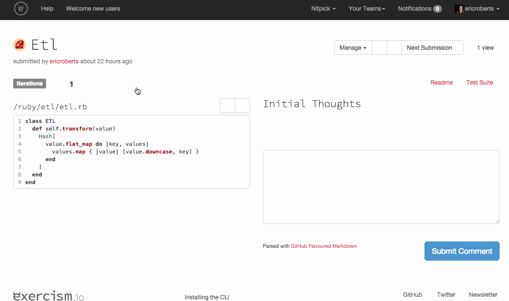
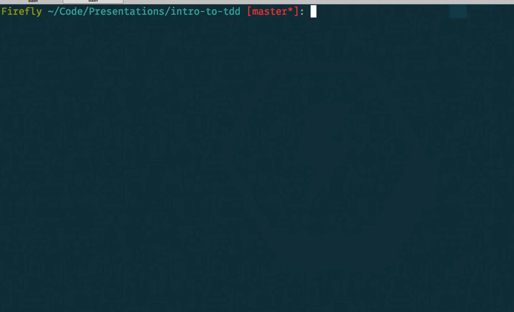

# Intro to TDD

---

# What is TDD?

---

# Test Driven Development

---

"first the developer writes an (initially failing) automated test case that defines a desired improvement or new function, then produces the minimum amount of code to pass that test, and finally refactors the new code to acceptable standards."

<sup>— Wikipedia</sub>

---

## 1. Write a failing test

---

## 2. Pass the test

---

## 3. Refactor
---

## red, green, refactor

---

# Why do TDD?

---

# Short feedback cycle

---



---



---

# Smaller pieces

^ Going off to implement a functionality all at once can be daunting. Breaking your problem down into small parts that can be tested helps you to start slow and build with confidence.

---

"even if I couldn't imagine an implementation I could almost always figure out how to write a test."

<sub>Kent Beck</sub>

^ Maybe you can't figure out how to write a test right now, that's what we're here to learn.

---

# Improve design

^ When you write tests that use your code, you are acting as a client of your own code. If it's hard to write the test, this can be an indication that the design of the code is not as good as it should be.

---

- Be a client of your own code.
- If it's hard to write the test, rethink your code.

---

# Refactor with confidence

---

- Stop avoiding old code because you are afraid of breaking it.
- Rework becomes enjoyable, not stressful.

^ Being able to change your code and have your tests inform you that everything is working as it should is incredibly helpful! No more fear of touching old code because you might not break it and not know. Of course, this makes it important to have lots of good tests.

---

# Why write the tests first?

---

- Demonstrates understanding of what it is we are going to do.
- Ensures we are testing the right thing.

^ Ensures that the test can actually possibly fail

^ When I write the code first, I expect my test to pass. Therefore I may not notice somebody else's mock or stub, and write an incorrect test. When I write the test first, I expect my test to fail, and so if it doesn't I know something is wrong.

---

## Let's get started!

---

There should be a method on Calculator called "add" that takes a string representation of a number ("1") and returns it as a number (1).

^ Write test that checks that "1" returns 1. Should stop and ask "what is the simplest way I could pass this test?". Define the method to simply return 1. Write better test that picks random number.

---

When I give the method an empty string (""), it should return 0.

---

``` ruby
require "minitest/autorun"
require_relative "calculator"

class TestCalculator < MiniTest::Unit::TestCase
  def test_given_string1_returns_1
    assert_equal Calculator.add("1"), 1
  end

  def test_given_string_returns_number
    number = rand(100)
    assert_equal Calculator.add(number.to_s), number
  end
end
```

---

``` ruby
class Calculator
  def self.add(string)
    string.to_i
  end
end
```

---

# Your Turn!
